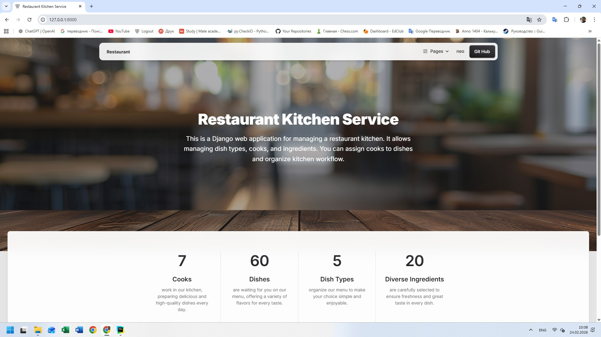
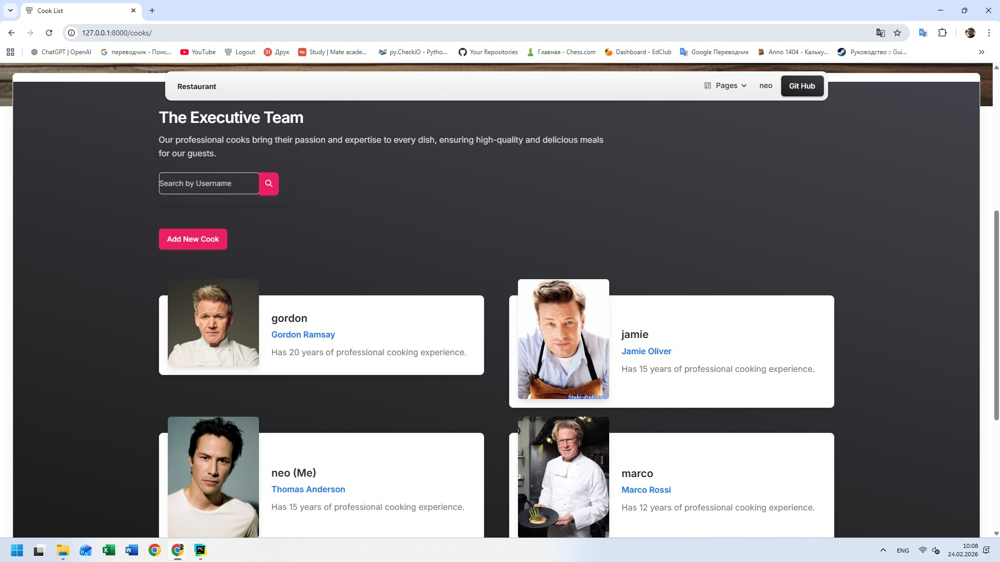
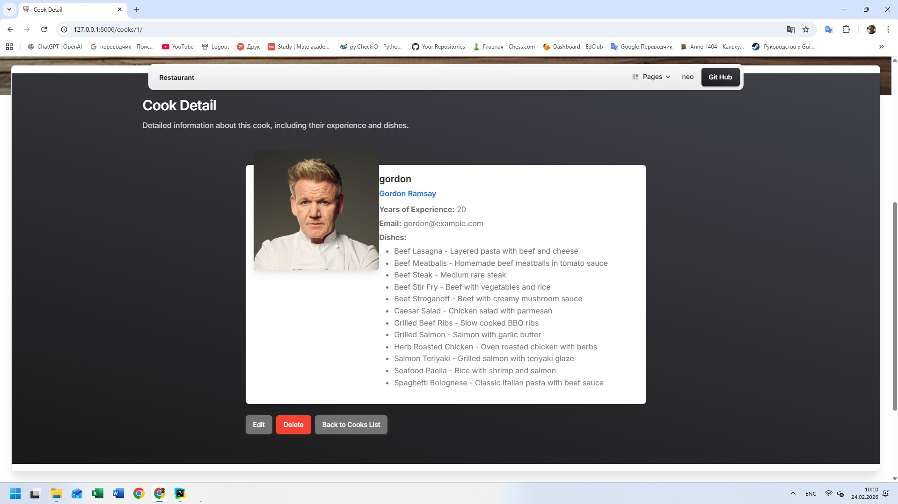
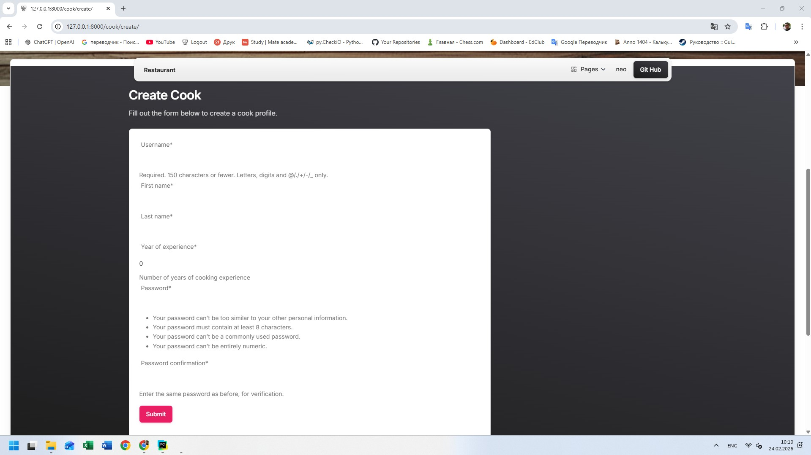
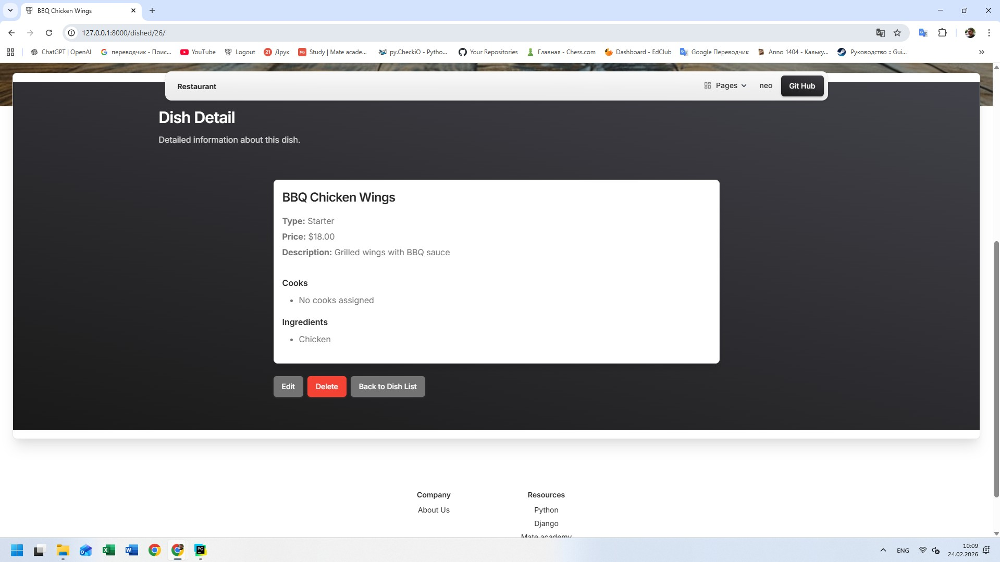
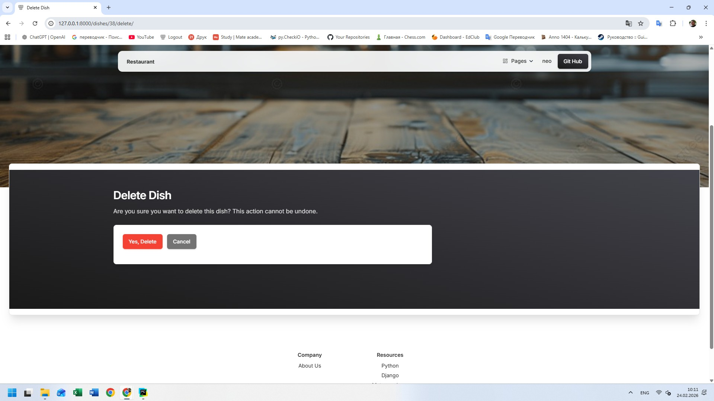

# Restaurant Kitchen Service

## 1. General Information

**Project Name:** restaurant-kitchen-service

**About:**  
This is a Django web application for managing a restaurant kitchen.  
It allows managing dish types, cooks, and ingredients.  
You can assign cooks to dishes and organize kitchen workflow.

**Project Goal:**  
The goal of this project is to show my skills in web development using Python, Django, SQLite, and JSON.  
It also shows how to work with models, views, templates, and data management.

## 2. Technologies

**Main Stack:**  
- Python 3.11  
- Django 4.3  
- SQLite database  

**Front-end:**  
- HTML, CSS, Bootstrap 4  
- Django templates  

**Libraries and Tools:**  
- Crispy Forms (crispy-bootstrap4) for forms styling  
- JSON for loading test data  
- Git for version control  

**Notes:**  
This project shows how to use Django models, views, and templates together.  
It also shows how to manage data with JSON and SQLite.

## 3. Functionality

**Models:**  
- `Cook` – custom user model with years of experience.  
- `Dish` – dishes with name, description, price, type, ingredients, and assigned cooks.  
- `DishType` – type of dish, e.g., appetizer, main course, dessert.  
- `Ingredient` – ingredients used in dishes.  

**Main Features:**  
- CRUD operations for cooks, dishes, dish types, and ingredients.  
- Cook assignments to dishes.  
- Search feature on all pages (cooks by username, dishes by name, dish types and ingredients by name).  
- Pagination on list pages.  
- Protected deletion: objects cannot be deleted if they are used by others (on_delete=PROTECT).  
- Staff-only permissions:  
  - Only staff users can create, update, or delete cooks and dishes.  
  - Dish types and ingredients can be created by all users, but deletion is protected.  
- Custom validation: unique names for ingredients and dish types.  
- Templates use Django ListView, DetailView, CreateView, UpdateView, DeleteView.  
- Forms styled with Crispy Forms (Bootstrap 4).  

**Notes:**  
The site is designed to prevent crashes. Protected objects show warnings instead of errors.  
Users can manage kitchen workflow safely with proper permissions and validations.

## 4. Installation and Running

**Steps to run locally:**  
1. Clone the repository:  
```bash
git clone https://github.com/VolodymyrHavrylenko/restaurant-kitchen-service.git

```
2. Open the project folder in your IDE
3. Create a virtual environment and activate it:
```bash
python -m venv .venv
# Windows
.venv\Scripts\activate
# Linux/Mac
source .venv/bin/activate

```
4. Install dependencies:
```bash
pip install -r requirements.txt

```
5. Migrate the database:
```bash
python manage.py migrate

```
6. Load test data (JSON fixtures, optional):
```bash
python manage.py loaddata restaurant_kitchen_service_db_data.json

```
7. Run the development server:
```bash
python manage.py runserver

```
8. Open your browser at http://127.0.0.1:8000/ to see the application.

**Notes:**  
- All pages have search and pagination features.  
- There are two superusers in the JSON fixtures for testing:  
  - **neo** with password `1qazcde3`  
  - **gordon** with password `3edczaq1`  
- Only staff users (superusers) can create, edit, or delete cooks and dishes.  
- There is also one regular user for testing:  
  - **jamie** with password `3edczaq1` (not staff)  
- Ingredients and dish types can be created by all users, but deletion is protected.

## 5. Screenshots

### Home page


### Cook List


### Cook Detail


### Cook Create


### Dish List


### Dish Detail


### Dish Delete



